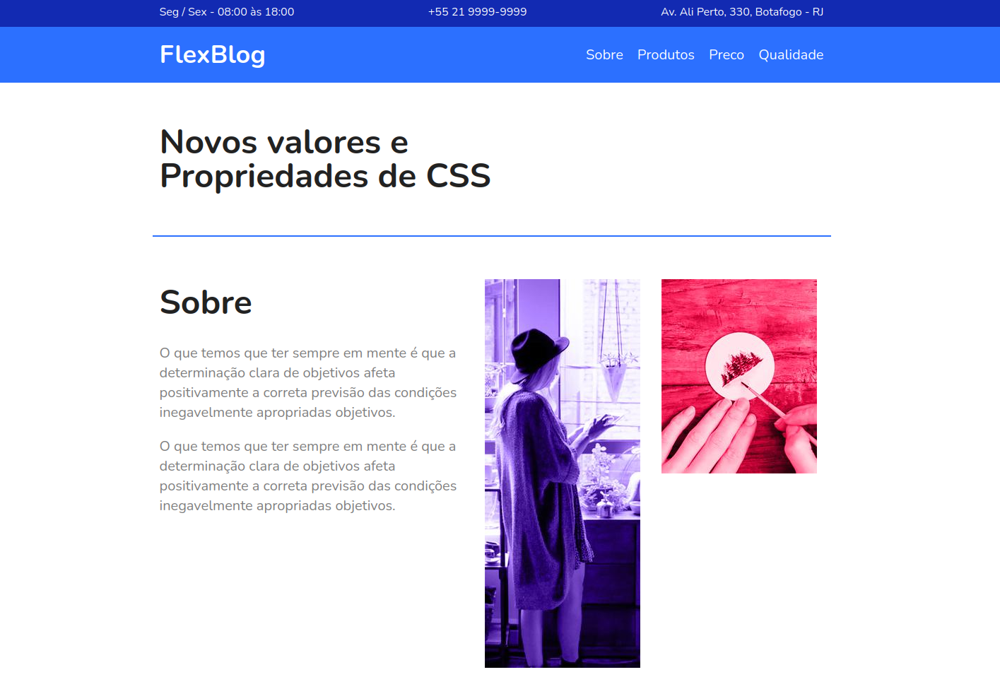

# FlexBlog
Landing page de conteúdo fictício, criada utilizando apenas posicionamento com CSS flexbox. Seu HTML também foi pra ser semântico.

## Imagens

## Objetivo
- Treinar o uso do CSS flexbox.

## Funcionalidade
- Responsividade.

## Tecnologias utilizadas
- HTML;
- CSS.